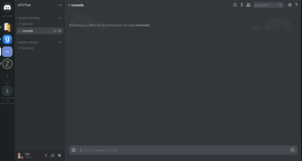

# discordjs-console

Stream your gameserver console on Discord.

This is a **very simple** implementation of mTxServ API with Discord.




# mTxServ credential

* OAuth: https://mtxserv.com/fr/mon-compte/oauth
* Api Key: https://mtxserv.com/fr/mon-compte/api

# Discord

## Create Bot

You need to create credential on Discord: https://discordapp.com/developers/applications/

* Create Application
* Go to `settings` -> `Bot`
* Click on button `Add Bot`
* Get token
* Set `Public bot` to `off`
* Go to `OAuth2`
* In scope section, set `Bot` to `on`
* Set bot permission `Send Message` to `on` and use the URL generated to add it on your server

# Install

```
npm install
```

# Configuration

To use this bot, you need to set your configuration in `config.json` :

```
cp config.json.dist config.json
```

# Usage

```
node index.js
```
